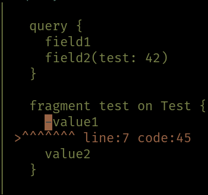

There are different types of errors in gql.

* Schema validation errors, which should be caught in development.
These are for instance caused by duplicate field names or invalid typenames.
* Query preparation errors, which are errors caused by invalid queries.
* Execuion errors. These are errors that occur during query evaluation, caused by resolvers that fail.

## Execution
Error handling in gql can be performed in two ways, it can be returned explicitly or raised in `F`.
For instance, the `EffectResolver[F, I, A]` wraps the function `I => F[Ior[String, A]]`.

## Examples
Let's setup the scene:
```scala mdoc
import gql.ast._
import gql.dsl._
import gql._
import cats.implicits._
import cats.data._
import cats.effect._
import cats.effect.unsafe.implicits.global
  
def multifailSchema = 
  tpe[IO, Unit](
    "Query", 
    "field" -> fallible(arg[Int]("i", Some(10))){ 
      case (_, 0) => IO.pure(Ior.left("fail gracefully"))
      case (_, 1) => IO.raiseError(new Exception("fail hard"))
      case (_, i) => IO.pure(Ior.right(i))
    }
  )

def go(query: String, tpe: Type[IO, Unit] = multifailSchema) = 
  Schema.query(tpe).flatMap { sch =>
    sch.assemble(query, variables = Map.empty)
      .traverse { 
        case Executable.Query(run) => 
          run(()).map{x => println(x.errors);x.asGraphQL }
        case Executable.ValidationError(msg) =>
          println(msg)
          IO.pure(msg.asGraphQL)
      }
  }.unsafeRunSync()
  
go("query { field }")
```

A query can fail gracefully by returning `Ior.left`:
```scala mdoc
go("query { field(i: 0) }")
```

A query can fail hard by raising an exception:
```scala mdoc
go("query { field(i: 1) }")
```

A query can also fail before even evaluating the query:
```scala mdoc
go("query { nonExisting }")
```

And finally, it can fail if it isn't parsable:
```scala mdoc
def largerQuery = """
  query {
    field1
    field2(test: 42)
  }
  
  fragment test on Test {
    -value1
    value2 
  }
"""

go(largerQuery).leftMap(_.prettyError.value)
```
Parser errors also look nice in ANSI terminals:



### Exception trick
If for whatever reason you wish to pass information through exceptions, that is also possible:
```scala mdoc
final case class MyException(msg: String, data: Int) extends Exception(msg)

val res = 
  Schema.query(
    tpe[IO, Unit](
      "Query",
      "field" -> eff(_ => IO.raiseError[String](MyException("fail hard", 42)))
    )
  ).flatMap { sch =>
    sch.assemble("query { field } ", variables = Map.empty)
      .traverse { case Executable.Query(run) => run(()) }
  }.unsafeRunSync()
  
res.toOption.flatMap(_.errors.headOption).flatMap(_.exception) match {
  case Some(MyException(_, data)) => println(s"Got data: $data")
  case _ => println("No data")
}
```
