## Planner algorithm
### The high-level idea
When planning for a query the planner assigns weights to every edge/field, optionally labels them with their batch names (if a batch resolver was used) and finally converts the problem to a simpler DAG (directed asyclic graph) form.
:::tip
For information on how the planner assigns weights, check out the [statistics](./statistics).
:::
The goal now is to form batches by contracting nodes that are batchable (jobs of the same family in scheduling/OR jargon).

For instance, assume the following DAG is in question:
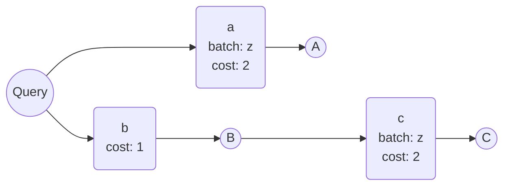
Now consider the following plan, where a possible contraction is colored red:
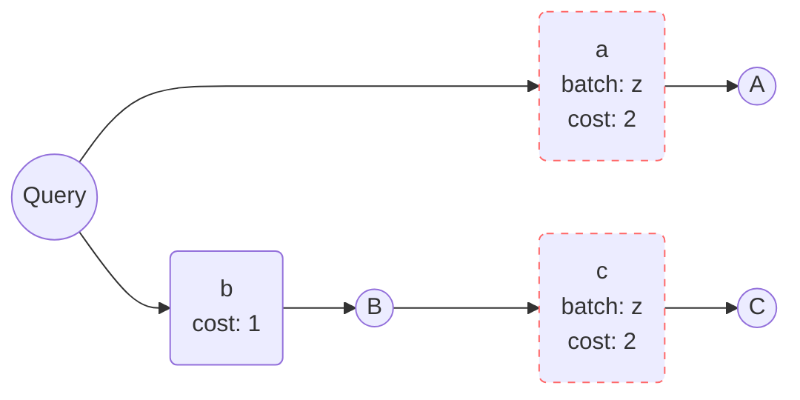
And contracted it becomes:
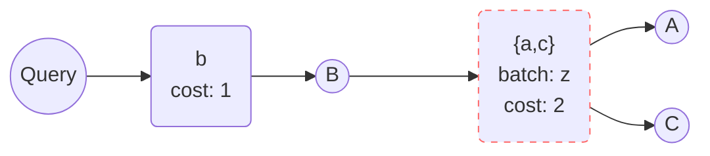

### Default planner intuition
The default planner heuristic in gql lazily enumerates all plans, imposing a locally greedy order to the enumerated plans.
The default planner also employs some simple but powerful pruning rules to eliminate trivially uninteresting plan variantions.

The planner works through the problem from the root(s) and down through the DAG.
The algorithm keeps some state regarding what batches have been visited and what nodes are scheduled in the "current plan".
In a round of planning the algorithm will figure out what nodes are schedulable by looking at it's state.

The planner will lazily generate all combinations of possible batches of schedulable nodes.
:::note
One can easily cause a combinatorial explosion by generation of combinations.
Fortunately we don't consider every plan (and in fact, the default algorithm only pulls $O(|V|)$ plans).
Furthermore, most problems will have less than n plans.
:::
The planner will always generate the largest batches first, hence the "locally greedy" ordering.

Trivially schedulable nodes are always scheduled first if possible; a pruning rules makes sure of this.
For a given scheduleable node, if no other un-scheduled node exists of the same family (excluding it's own descendants), then that node's only and optimal batch is the singleton batch containing only that node.

There are other pruning rules that have been considered, but don't seem necessary for practical problems since most problems produce very few plans.

One such pruning rule consideres "optimal" generated batch combinations.
If the largest batch that the planner can generate $n \choose n$ contains nodes that all have the same "latest ending parent", then all other combinations ${n \choose k} \text{ where } k < n$ are trivially fruitless.

Once the planner has constructed a lazy list of batches, it then consideres every plan that _could_ exist for every batch, hence a computational difficulty of finding the **best** plan.
:::info
If you want to understand the algorithm better, consider taking a look at the source code.
:::

### Converting a query to a problem
gql considers only resolvers when running query planning.
Every field that is traversed in a query is expanded to all the resolvers it consists such that it becomes a digraph.

As an example, consider the following instance:
```scala mdoc

```

Initially there must be a schema and query:
```scala mdoc
type B = String
type D = String
type E = String
type F = String

case class A(d: D, e: E)
case class C(f: F)
case class Query(a: A, b: B, c: C)

def q = """
  query {
    house(id: ID) {
      owner {
        name
        netWorth
      }
      remainingMortgage
      info {
        residents {
          name
        }
      }
      constructionYear
    }
  }
"""
```


import Treemap from '@site/src/components/Treemap';

<Treemap
    root = {"house"}
    height = {800}
    nodes = {[
    { id: "house", info: { text: "house" }, cost: 1, children: ["owner", "mortgage", "info", "constructionyear"] },
      { id: "owner", info: { text: ["owner", "cost: 2", "batch: person_db"] }, cost: 2, children: ["ownername", "ownernetworth"]},
        { id: "ownername", info: { text: ["name", "cost: 1"] }, cost: 1, },
        { id: "ownernetworth", info: { text: ["netWorth", "cost: 3", "batch: banking"] }, cost: 3, },
      { id: "mortgage", info: { text: ["remainingMortgage", "cost: 3", "batch: banking"] }, cost: 3, },
      { id: "info", info: { text: ["info", "cost: 2", "batch: house_db"] }, cost: 2, children: ["residents"] },
        { id: "residents", info: { text: ["residents", "cost: 2", "batch: person_db"] }, cost: 2, children: ["residentsname"]},
          { id: "residentsname", info: { text: ["name", "cost: 1"] }, cost: 1, },
      { id: "constructionyear", info: { text: ["constructionYear", "cost: 9"] }, cost: 9, },
    ]}
/>

<Treemap
    root = {"house"}
    height = {800}
    nodes = {[
    { id: "house", info: { text: "house" }, cost: 1, children: ["owner_pad", "mortgage_pad", "info_pad", "constructionyear"] },
      { id: "owner_pad", cost: 4, info: { text: ["banking: 1"], hide:true }, children: ["owner"]},
        { id: "owner", info: { text: ["owner", "cost: 2", "batch: person_db"] }, cost: 2, children: ["ownername_pad", "ownernetworth"]},
          { id: "ownername_pad", cost: 2, children:["ownername"] },
            { id: "ownername", info: { text: ["name", "cost: 1"] }, cost: 1, },
          { id: "ownernetworth", info: { text: ["netWorth", "cost: 3", "batch: banking"] }, cost: 3, },
      { id: "mortgage_pad", cost: 6, children:["mortgage"] },
        { id: "mortgage", info: { text: ["remainingMortgage", "cost: 3", "batch: banking"] }, cost: 3, },
      { id: "info_pad", cost: 4, info: { text: ["person_db: 1"], hide:true }, children: ["info"] },
        { id: "info", info: { text: ["info", "cost: 2", "batch: house_db"] }, cost: 2, children: ["residents"] },
          { id: "residents", info: { text: ["residents", "cost: 2", "batch: person_db"] }, cost: 2, children: ["residentsname"]},
            { id: "residentsname", info: { text: ["name", "cost: 1"] }, cost: 1, },
        { id: "constructionyear", info: { text: ["constructionYear", "cost: 9"] }, cost: 9, },
    ]}
/>


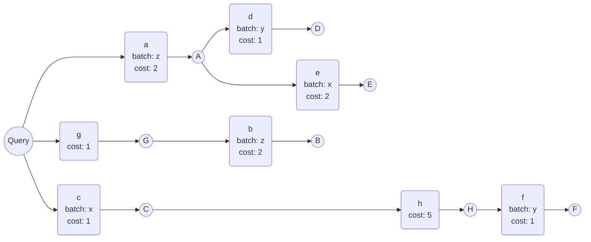

We drop all type information from this graph, so only the edges (resolvers) remain.

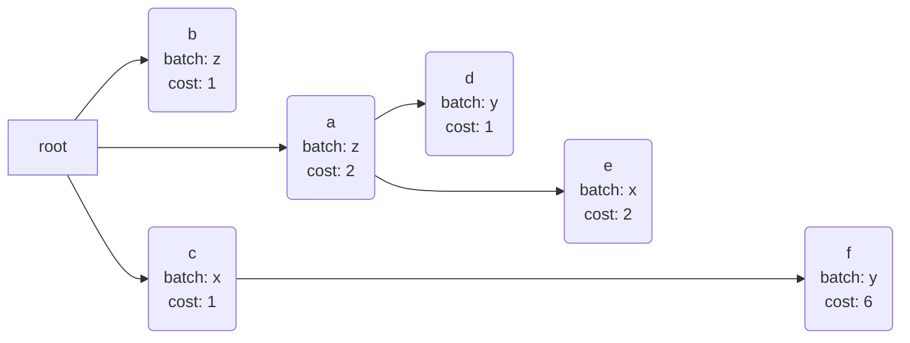

Then we compute the end times for all nodes:
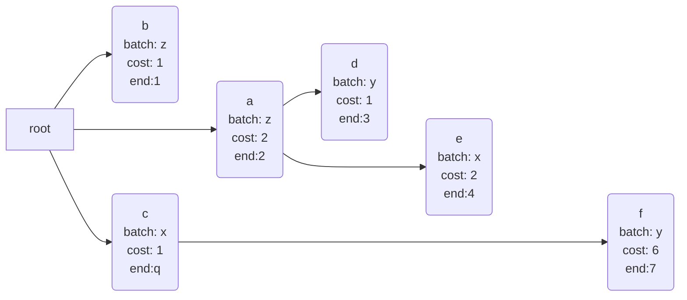

Let the `maxEnd` to be `7`, since node `f` has end `7`.

The next step is to move every node as far down as possible.
We start in the leaves, and work our way up.
A can move no further than the smallest start (end - cost) of its children.
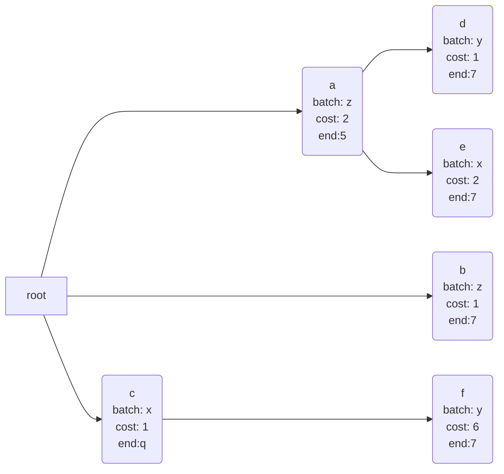

Now we run through every node, sorted by end time, and move it up to either the smallest batch possibility (same batch name), or as far up as possible, if not batching opportunity can be discovered.
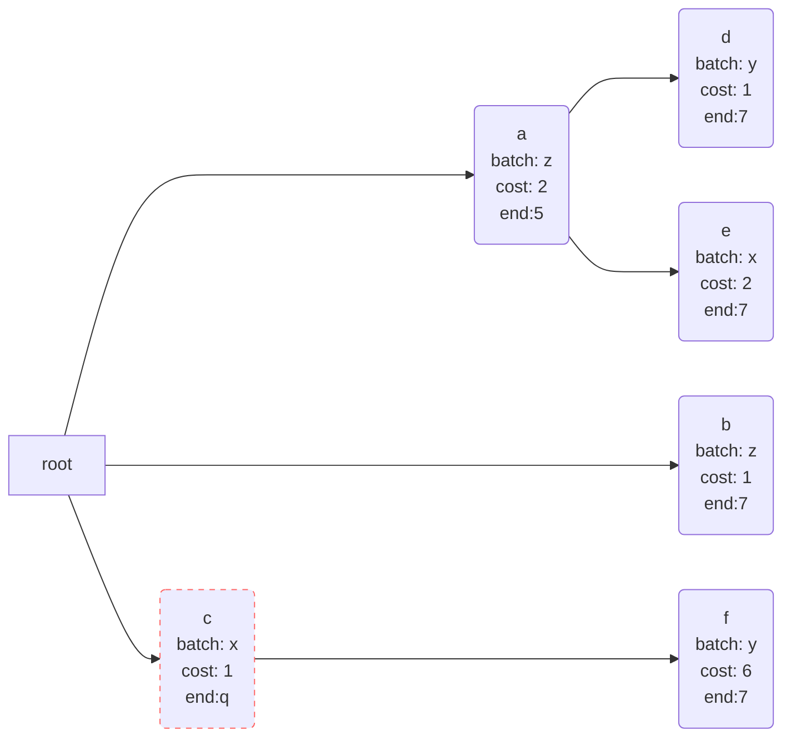
c cannot be moved, thus it must remain where it is.
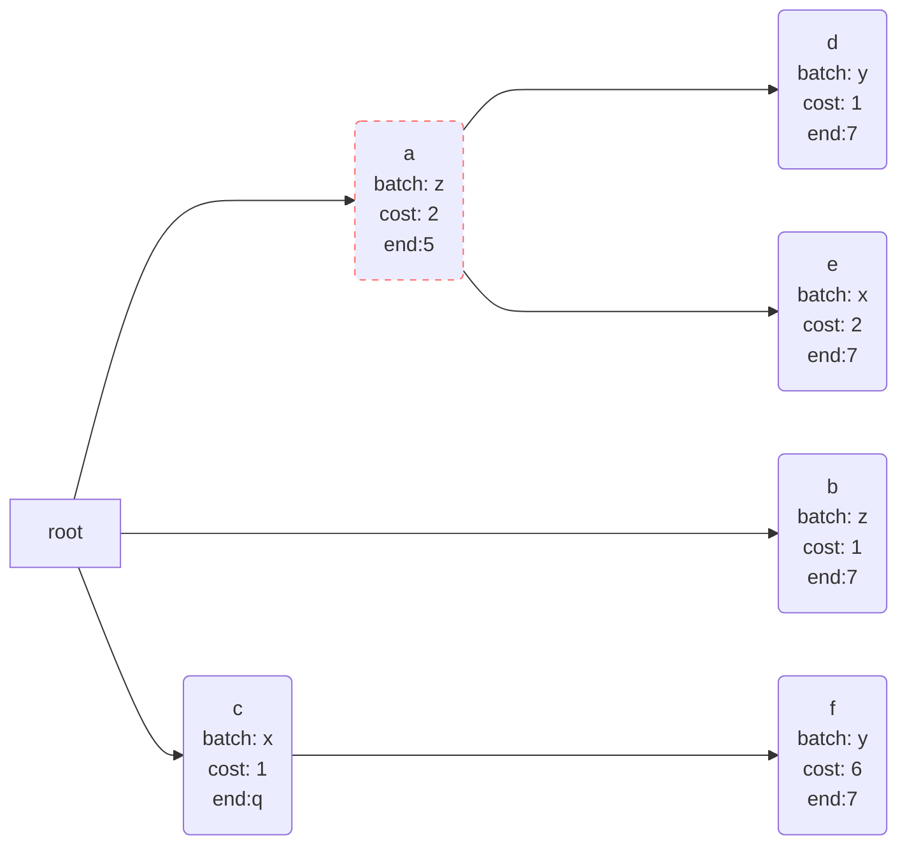
A has no batching opportunity, so it is moved up to `2`.
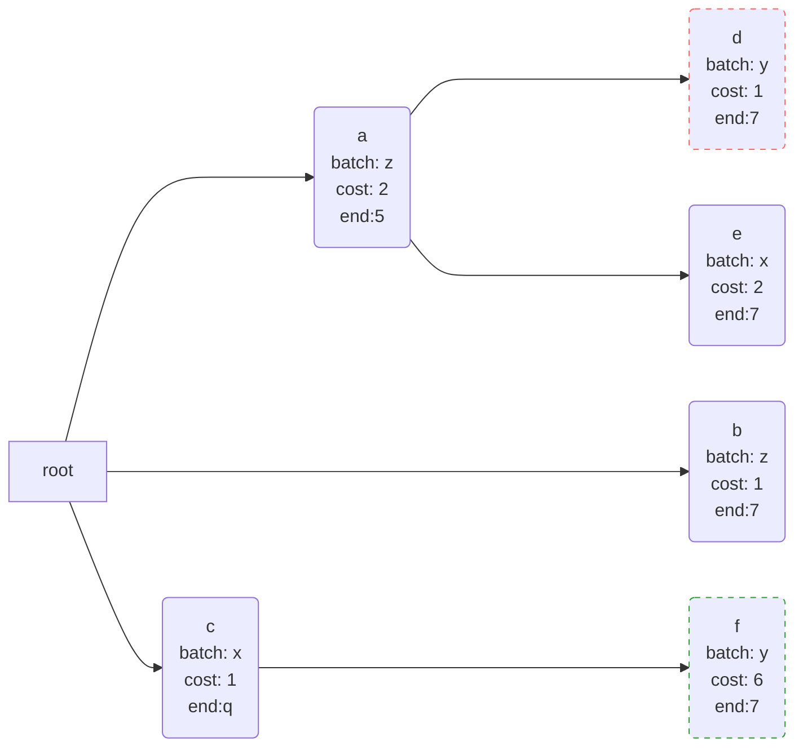
`d`'s best batching opportunity is `f`, so it remains.
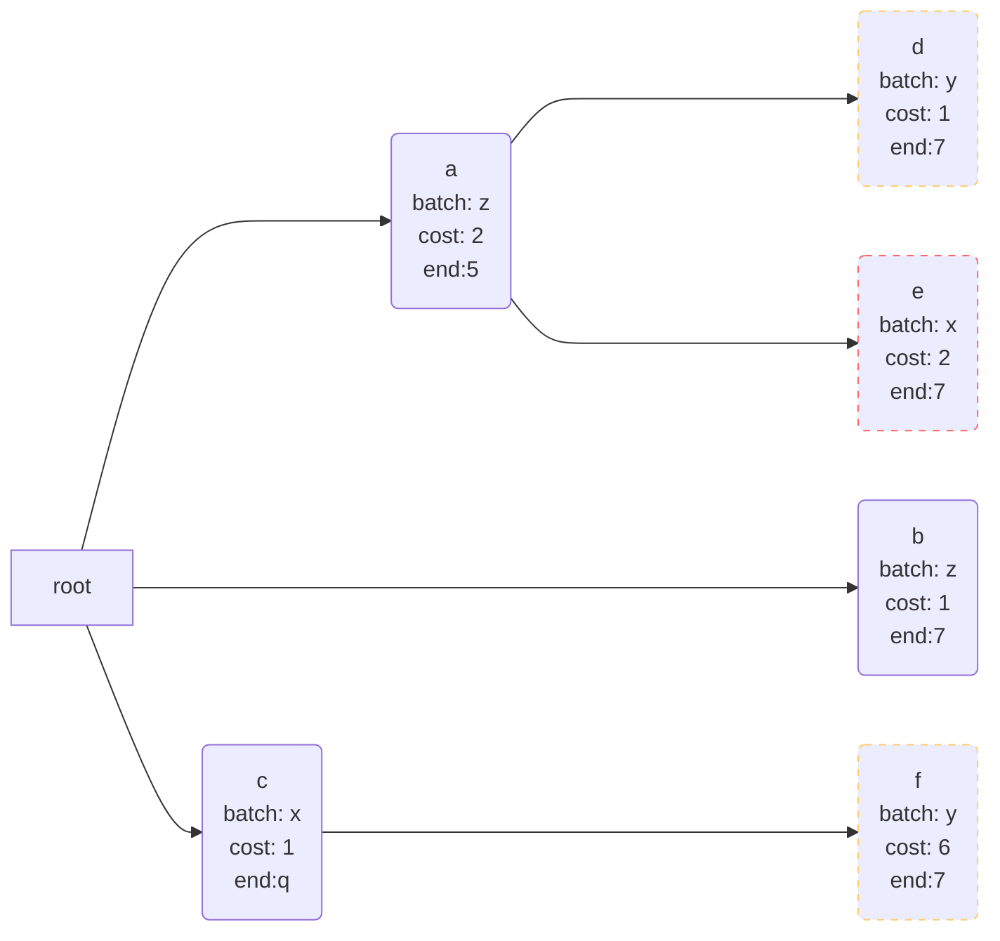
`e` cannot move up, since it's parent's (`a`) end (`5`) is the same as `e`'s start (`7 - 2 = 5`).
:::note
Planning in end time is easier than planning in start time.
However converting one to the other is trivial (subtract or add the cost).

If two nodes have the same batch name, they will always have the same cost.
That is, if two nodes with the same batch name and end-time, they will also have the same start time.
:::
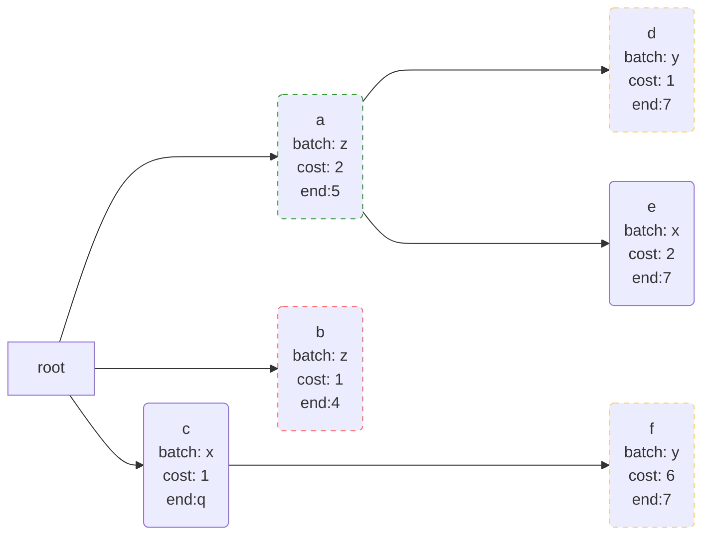

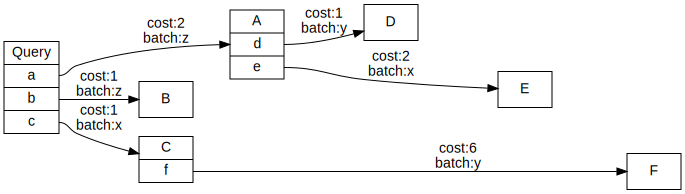
Now all the structure/grouping of fields is dropped and only the edges/relations are kept.
Furthermore every edge has it's end-time computed, which is the sum of the costs of all the edges that are traversed to get to that edge.

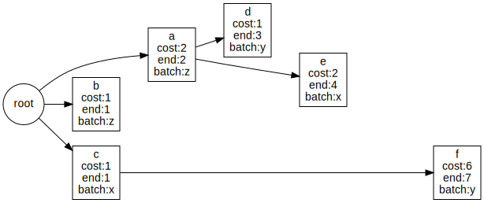

The `maxEnd` value is assigned the maximum ending time, that is, `f` or rather 7.
All edges are now sorted by end time descending, and the edges are traversed in that order.
That means, we start with the edge `f`.
We first check if `f` has any children, which it doesn't.
Then we push `f` as far down as possible, which is where it is already at since `maxEnd = end(f)`.
The node in focus is marked by green:


Next up is `e`.
`e` also has no children, so it can be pushed all the way down to `maxEnd`.

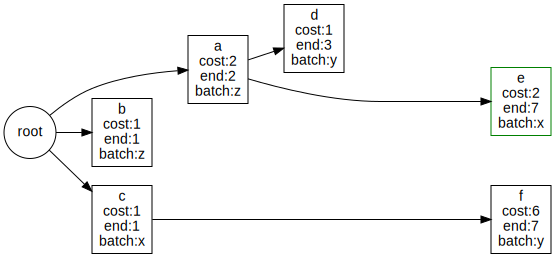

Next is `d`.
`d` has no children, so it can be pushed all the way down to `maxEnd`.

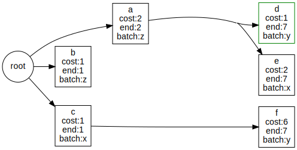

Notice that `d` and `f` have the same `end`, thus they can be batched together.


Next is `a`.
`a` has children, so it can at most be pushed to the child with the smallest `start = end - cost`; in this case `e` since `start(e) = end(e) - cost(e) = 7 - 2 = 5`.
`end(a) = 5`:


Now we handle `b`.
`b` has no children, so it **can** move all the way down to `maxEnd`.
But `b` has a compatible batching possibility with `a` (`batch(b) = z = batch(a)`).
Since `a` is smaller than the `maxEnd` (`end(a) <= maxEnd`) then `b` may move down to `a` so it is moved to `end(b) = end(a) = 5`:
:::note
When checking node compatability we only check against nodes we have already traversed, such that it is implicitly true that we never try to move up.
:::

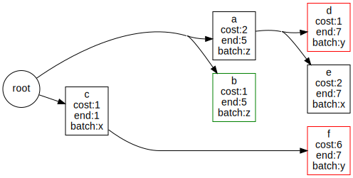

Finally we check `c`.
This node can do nothing, since it's child `f` allows it no "wiggle room" (`end(c) = start(f)`):

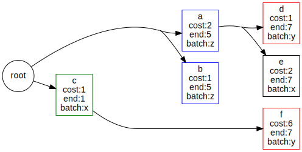

Putting everything together; For every node:
* If the node has no children: it's "maximum possible end" is `maxEnd`.
* Else: it's "maximum possible end" is the minimum of it's children's starting time.
* Does the node have compatible batching possibilities with other previously moved nodes?
  * Yes: Find the node with the largest end that is also smaller than this node's "maximum possible end" and set this node's end to that node's end.
  * _: move the node to it's "maximum possible end" to free up as much space as possible for other batching possibilities.

:::info
The planner will only place the constraint of awaiting batches onto query evaluation.
Said in another way, nodes that do not participate in batching will be evaluated as soon as possible in parallel.

Nodes that do participate in a batch, will semantically block until all inputs have arrived.
:::

## Modifying query plans
The `Schema` captures an instance of `Planner` which is a function of type `NodeTree => F[NodeTree]`.
The `Planner` interface simple re-structures the tree of edges in a query plan.
The `Planner` can be overwritten if you're unhappy with the default planner, or if you have special requirements for the plan.

For instance, maybe you have more information about an edge that would improve the planner's ability to make a good plan.

## Debugging
We can print the query plan and show the improvement in comparison to the naive plan.
Let's pull out the Star Wars schema:
```scala mdoc
import cats.effect.unsafe.implicits.global
import cats.effect._
import cats.implicits._
import gql._
import gql.server.planner._

def schemaF = gql.StarWarsSchema.schema
```
If we explicitly invoke the planner on our schema, we can ask to see a rendered version of the query plan:
```scala mdoc
def loggedSchema = schemaF.map{ schema =>
  schema.copy(planner = new Planner[IO] {
    def plan(naive: NodeTree): IO[OptimizedDAG] =
      schema.planner.plan(naive).map { output =>
        println(output.show(ansiColors = false))
        println(s"optimized: ${output.totalCost}")
        output
      }
  })
}

def query = """
  query NestedQuery {
    hero {
      name
      friends {
        name
        appearsIn
        friends {
          name
        }
      }
    }
  }
"""

loggedSchema.flatMap{ schema =>
  Compiler[IO].compile(schema, query)
    .traverse_{ case Application.Query(fa) => fa }
}.unsafeRunSync()
```
:::note
The Star Wars schema has no batchers, so the optimized variant will not be particularly interesting.
:::

The plan can also be shown nicely in a terminal with ANSI colors:

