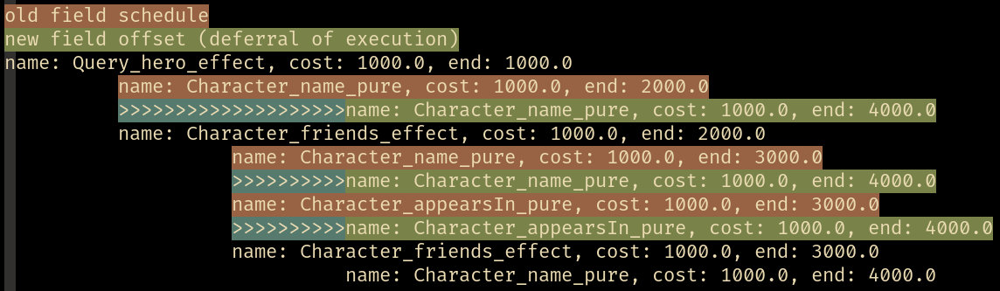

## Planner algorithm
### The high-level idea
When planning for a query the planner assigns weights to every edge/field, optionally labels them with their batch names (if a batch resolver was used) and finally converts the problem to a simpler DAG (directed asyclic graph) form.
:::tip
For information on how the planner assigns weights, check out the [statistics](statistics.md).
:::
The goal now is to form batches by contracting nodes that are batchable (jobs of the same family in scheduling/OR jargon).

For instance, assume the following DAG is in question:

Now consider the following plan, where a possible contraction is colored red:

And contracted it becomes:


### Default planner intuition
The default planner heuristic in gql lazily enumerates all plans, imposing a locally greedy order to the enumerated plans.
The default planner also employs some simple but powerful pruning rules to eliminate trivially uninteresting plan variantions.

The planner works through the problem from the root(s) and down through the DAG.
The algorithm keeps some state regarding what batches have been visited and what nodes are scheduled in the "current plan".
In a round of planning the algorithm will figure out what nodes are schedulable by looking at it's state.

The planner will lazily generate all combinations of possible batches of schedulable nodes.
:::note
One can easily cause a combinatorial explosion by generation of combinations.
Fortunately we don't consider every plan (and in fact, the default algorithm only pulls $O(|V|)$ plans).
Furthermore, most problems will have less than n plans.
:::
The planner will always generate the largest batches first, hence the "locally greedy" ordering.

Trivially schedulable nodes are always scheduled first if possible; a pruning rules makes sure of this.
For a given scheduleable node, if no other un-scheduled node exists of the same family (excluding it's own descendants), then that node's only and optimal batch is the singleton batch containing only that node.

There are other pruning rules that have been considered, but don't seem necessary for practical problems since most problems produce very few plans.

One such pruning rule consideres "optimal" generated batch combinations.
If the largest batch that the planner can generate $n \choose n$ contains nodes that all have the same "latest ending parent", then all other combinations ${n \choose k} \text{ where } k < n$ are trivially fruitless.

Once the planner has constructed a lazy list of batches, it then consideres every plan that _could_ exist for every batch, hence a computational difficulty of finding the **best** plan.
:::info
If you want to understand the algorithm better, consider taking a look at the source code.
:::

### Converting a query to a problem
gql considers only resolvers when running query planning.
Every field that is traversed in a query is expanded to all the resolvers it consists such that it becomes a digraph.

As an example, consider the following instance:
```scala mdoc:silent
import gql._
import gql.dsl._
import gql.server.planner._
import gql.resolver._
import scala.concurrent.duration._
import cats.implicits._
import cats.effect._
import cats.effect.unsafe.implicits.global

case object Child

def wait[I](ms: Int) = Resolver.liftF[IO, I](_ => IO.sleep(50.millis))

val schem = Schema.stateful{
  Resolver.batch[IO, Unit, Int](_ => IO.sleep(10.millis) as Map(() -> 42)).flatMap{ b1 =>
    Resolver.batch[IO, Unit, String](_ => IO.sleep(15.millis) as Map(() -> "42")).map{ b2 =>
      implicit lazy val child = builder[IO, Child.type]{ b =>
        b.tpe(
          "Child",
          "b1" -> b.from(wait(50) andThen b1.optional map (_.get)),
          "b2" -> b.from(wait(100) andThen b2.optional map (_.get)),
        )
      }

      SchemaShape.unit[IO](
        builder[IO, Unit]{ b =>
          b.fields(
            "child" -> b.from(wait(42) as Child),
            "b2" -> b.from(wait(25) andThen b2.optional map (_.get))
          )
        }
      )
    }
  }
}.unsafeRunSync()
```
Now let's define our query and modify our schema so the planner logs:
```scala mdoc:silent
val qry = """
  query {
    child {
      b1
      b2
    }
    b2
  }
"""

val withLoggedPlanner = schem.copy(planner = new Planner[IO] {
  def plan(naive: NodeTree): IO[OptimizedDAG] =
    schem.planner.plan(naive).map { output =>
      println(output.show(ansiColors = false))
      println(s"naive: ${output.totalCost}")
      println(s"optimized: ${output.optimizedCost}")
      output
    }
})
```
And we plan for it inspect the result:
```scala mdoc
def runQry() = {
  Compiler[IO]
    .compile(withLoggedPlanner, qry)
    .traverse_{ case Application.Query(fa) => fa }
    .unsafeRunSync()
}

runQry()
```
We can warm up the weights (statistics) a bit by running the query a few times:
```scala mdoc:silent
(0 to 10).toList.foreach(_ => runQry())
```
Now we can see how the weights are assigned:
```scala mdoc
runQry()
```

Plans can also be shown nicely in a terminal with ANSI colors:

