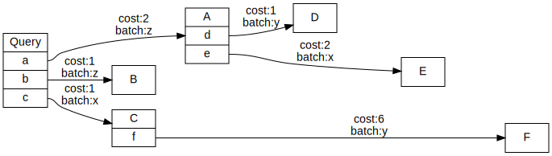
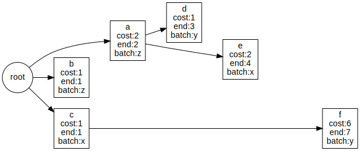
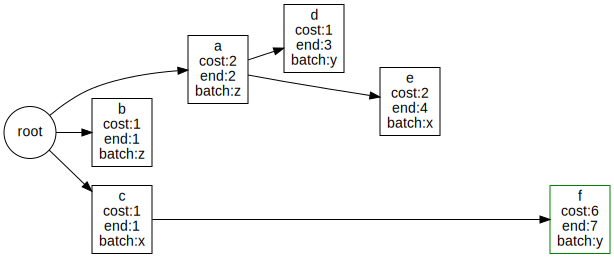
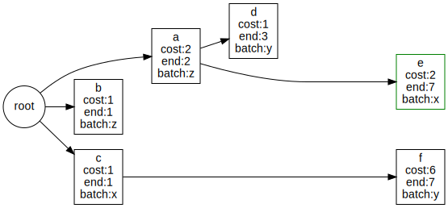
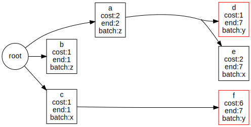
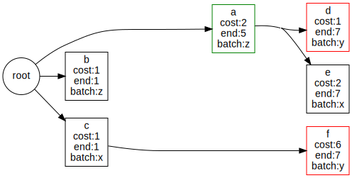
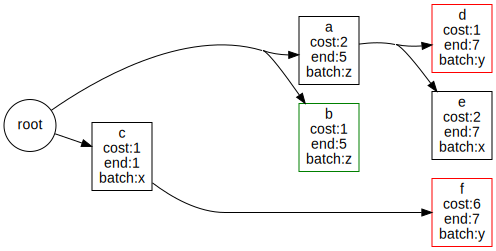
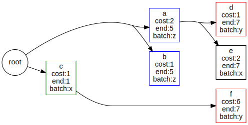
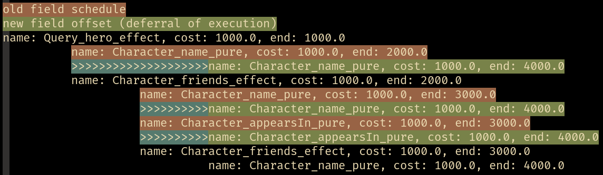

## Planner algorithm
Initially there must be a schema and query:
```scala
type B = String
type D = String
type E = String
type F = String

case class A(d: D, e: E)
case class C(f: F)
case class Query(a: A, b: B, c: C)

def q = """
  query {
    a {
      d
      e
    }
    b
    c {
      f
    }
  }
"""
```

Then the planner assigns weights to every edge/field, and optionally labels them with their batch names (if a batch resolver was used):
:::tip
For information on how the planner assigns weights, check out the [statistics](./statistics).
:::



Now all the structure/grouping of fields is dropped and only the edges/relations are kept.
Furthermore every edge has it's end-time computed, which is the sum of the costs of all the edges that are traversed to get to that edge.



The `maxEnd` value is assigned the maximum ending time, that is, `f` or rather 7.
All edges are now sorted by end time descending, and the edges are traversed in that order.
That means, we start with the edge `f`.
We first check if `f` has any children, which it doesn't.
Then we push `f` as far down as possible, which is where it is already at since `maxEnd = end(f)`.
The node in focus is marked by green:



Next up is `e`.
`e` also has no children, so it can be pushed all the way down to `maxEnd`.



Next is `d`.
`d` has no children, so it can be pushed all the way down to `maxEnd`.


Notice that `d` and `f` have the same `end`, thus they can be batched together.



Next is `a`.
`a` has children, so it can at most be pushed to the child with the smallest `start = end - cost`; in this case `e` since `start(e) = end(e) - cost(e) = 7 - 2 = 5`.
`end(a) = 5`:



Now we handle `b`.
`b` has no children, so it **can** move all the way down to `maxEnd`.
But `b` has a compatible batching possibility with `a` (`batch(b) = z = batch(a)`).
Since `a` is smaller than the `maxEnd` (`end(a) <= maxEnd`) then `b` may move down to `a` so it is moved to `end(b) = end(a) = 5`:
:::note
When checking node compatability we only check against nodes we have already traversed, such that it is implicitly true that we never try to move up.
:::



Finally we check `c`.
This node can do nothing, since it's child `f` allows it no "wiggle room" (`end(c) = start(f)`):



Putting everything together; For every node:
* If the node has no children: it's "maximum possible end" is `maxEnd`.
* Else: it's "maximum possible end" is the minimum of it's children's starting time.
* Does the node have compatible batching possibilities with other previously moved nodes?
  * Yes: Find the node with the largest end that is also smaller than this node's "maximum possible end" and set this node's end to that node's end.
  * _: move the node to it's "maximum possible end" to free up as much space as possible for other batching possibilities.

:::info
The planner will only place the constraint of awaiting batches onto query evaluation.
Said in another way, nodes that do not participate in batching will be evaluated as soon as possible in parallel.

Nodes that do participate in a batch, will semantically block until all inputs have arrived.
:::

## Modifying query plans
The `Schema` captures an instance of `Planner` which is a function of type `NodeTree => F[NodeTree]`.
The `Planner` interface simple re-structures the tree of edges in a query plan.
The `Planner` can be overwritten if you're unhappy with the default planner, or if you have special requirements for the plan.

For instance, maybe you have more information about an edge that would improve the planner's ability to make a good plan.

## Debugging
We can print the query plan and show the improvement in comparison to the naive plan.
Let's pull out the Star Wars schema:
```scala
import cats.effect.unsafe.implicits.global
import cats.effect._
import cats.implicits._
import gql._

def schemaF = gql.StarWarsSchema.schema
```
If we explicitly invoke the planner on our schema, we can ask to see a rendered version of the query plan:
```scala
def loggedSchema = schemaF.map{ schema =>
  schema.copy(planner = new Planner[IO] {
    def plan(naive: Planner.NodeTree): IO[Planner.NodeTree] =
      schema.planner.plan(naive).map { output =>
        println(output.show(showImprovement = true, ansiColors = false))
        println(s"naive: ${naive.totalCost}")
        println(s"optimized: ${output.totalCost}")
        output
      }
  })
}

def query = """
  query NestedQuery {
    hero {
      name
      friends {
        name
        appearsIn
        friends {
          name
        }
      }
    }
  }
"""

loggedSchema.flatMap{ schema =>
  Compiler[IO].compile(schema, query)
    .traverse_{ case Application.Query(fa) => fa }
}.unsafeRunSync()
// name: Query_hero_effect, cost: 100.0, end: 100.0
//           name: Character_name_pure, cost: 100.0, end: 200.0
//           >>>>>>>>>>>>>>>>>>>>name: Character_name_pure, cost: 100.0, end: 400.0
//           name: Character_friends_effect, cost: 100.0, end: 200.0
//                     name: Character_name_pure, cost: 100.0, end: 300.0
//                     >>>>>>>>>>name: Character_name_pure, cost: 100.0, end: 400.0
//                     name: Character_appearsIn_pure, cost: 100.0, end: 300.0
//                     >>>>>>>>>>name: Character_appearsIn_pure, cost: 100.0, end: 400.0
//                     name: Character_friends_effect, cost: 100.0, end: 300.0
//                               name: Character_name_pure, cost: 100.0, end: 400.0
// 
// naive: 700.0
// optimized: 700.0
```
:::note
The Star Wars schema has no batchers, so the optimized variant will not be particularly interesting.
:::

The plan can also be shown nicely in a terminal with ANSI colors:

