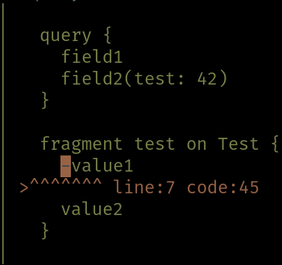

There are different types of errors in gql.

* Schema validation errors, which should be caught in development.
These are for instance caused by duplicate field names or invalid typenames.
* Query preparation errors, which are errors caused by invalid queries.
* Execuion errors. These are errors that occur during query evaluation, caused by resolvers that fail.

## Execution
Error handling in gql can be performed in two ways, it can be returned explicitly or raised in `F`.
For instance, the `EffectResolver[F, I, A]` wraps the function `I => F[Ior[String, A]]`.

## Examples
Let's setup the scene:
```scala
import gql.ast._
import gql.dsl._
import gql.dsl.value._
import gql._
import cats.implicits._
import cats.data._
import cats.effect._
import cats.effect.unsafe.implicits.global
  
def multifailSchema = 
  tpe[IO, Unit](
    "Query", 
    "field" -> fallible(arg[Int]("i", scalar(10))){ 
      case (_, 0) => IO.pure(Ior.left("fail gracefully"))
      case (_, 1) => IO.raiseError(new Exception("fail hard"))
      case (_, i) => IO.pure(Ior.right(i))
    }
  )

def go(query: String, tpe: Type[IO, Unit] = multifailSchema) = 
  Schema.query(tpe).flatMap { sch =>
    Compiler[IO].compile(sch, query) match {
      case Left(err) => 
        println(err)
        IO.pure(err.asGraphQL)
      case Right(Application.Query(fa)) => 
        fa.map{x => println(x.errors);x.asGraphQL }
    }
  }.unsafeRunSync()
  
go("query { field }")
// Chain()
// res0: io.circe.JsonObject = object[data -> {
//   "field" : 10
// }]
```

A query can fail gracefully by returning `Ior.left`:
```scala
go("query { field(i: 0) }")
// Chain(EffectResolution(Cursor(Chain(Field(1,field))),Right(fail gracefully),()))
// res1: io.circe.JsonObject = object[errors -> [
//   {
//     "message" : "fail gracefully",
//     "path" : [
//       "field"
//     ]
//   }
// ],data -> {
//   "field" : null
// }]
```

A query can fail hard by raising an exception:
```scala
go("query { field(i: 1) }")
// Chain(EffectResolution(Cursor(Chain(Field(1,field))),Left(java.lang.Exception: fail hard),()))
// res2: io.circe.JsonObject = object[errors -> [
//   {
//     "message" : "internal error",
//     "path" : [
//       "field"
//     ]
//   }
// ],data -> {
//   "field" : null
// }]
```

A query can also fail before even evaluating the query:
```scala
go("query { nonExisting }")
// Preparation(PositionalError(PrepCursor(Chain()),List(Caret(0,20,20)),unknown field name nonExisting))
// res3: io.circe.JsonObject = object[errors -> [
//   {
//     "message" : "unknown field name nonExisting",
//     "locations" : [
//       {
//         "line" : 0,
//         "column" : 20
//       }
//     ]
//   }
// ]]
```

And finally, it can fail if it isn't parsable:
```scala
def largerQuery = """
  query {
    field1
    field2(test: 42)
  }
  
  fragment test on Test {
    -value1
    value2 
  }
"""

go(largerQuery)
// Parse(ParseError(Caret(8,4,80),cats.Later@c93ec0d))
// res4: io.circe.JsonObject = object[errors -> [
//   {
//     "message" : "could not parse query",
//     "locations" : [
//       {
//         "line" : 8,
//         "column" : 4
//       }
//     ],
//     "error" : "\u001b[34mfailed at offset 80 on line 7 with code 45\none of \"...\"\nin char in range A to Z (code 65 to 90)\nin char in range _ to _ (code 95 to 95)\nin char in range a to z (code 97 to 122)\nin query:\n\u001b[0m\u001b[32m| \u001b[0m\u001b[32m\n|   query {\n|     field1\n|     field2(test: 42)\n|   }\n|   \n|   fragment test on Test {\n|     \u001b[41m\u001b[30m-\u001b[0m\u001b[32mvalue1\n| \u001b[31m>^^^^^^^ line:7 code:45\u001b[0m\u001b[32m\n|     value2 \n|   }\n| \u001b[0m\u001b[0m"
//   }
// ]]
```
Parser errors also look nice in ANSI terminals:



### Exception trick
If for whatever reason you wish to pass information through exceptions, that is also possible:
```scala
final case class MyException(msg: String, data: Int) extends Exception(msg)

val res = 
  Schema.query(
    tpe[IO, Unit](
      "Query",
      "field" -> eff(_ => IO.raiseError[String](MyException("fail hard", 42)))
    )
  ).flatMap { sch =>
    Compiler[IO].compile(sch, "query { field } ") match {
      case Right(Application.Query(run)) => run
    }
  }.unsafeRunSync()
// res: QueryResult = QueryResult(
//   errors = Singleton(
//     a = EffectResolution(
//       path = Cursor(path = Singleton(a = Field(id = 1, name = "field"))),
//       error = Left(value = MyException(msg = "fail hard", data = 42)),
//       input = ()
//     )
//   ),
//   data = object[field -> null]
// )
  
res.errors.headOption.flatMap(_.exception) match {
  case Some(MyException(_, data)) => println(s"Got data: $data")
  case _ => println("No data")
}
// Got data: 42
```
